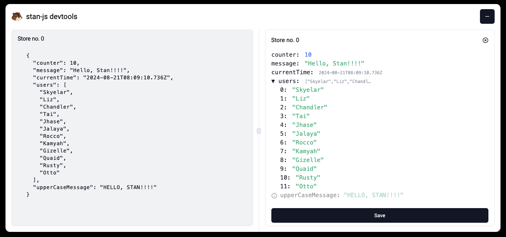

# stan-js devtools

[](https://react.dev/)
[](https://reactnative.dev/)
[](https://nextjs.org/)
[](https://www.npmjs.com/package/stan-js-devtools)

## 🦫 Features

- 🐞 Debug store values with ease
- ⚛️ Works with React / Expo / Next.js
- 🔌 Plug and play

## 📺 Preview



## 📦 Installation

> [!WARNING]  
> You need stan-js >= 1.5.0 to use devtools

```bash
npm i -D stan-js-devtools
yarn add -D stan-js-devtools
pnpm add -D stan-js-devtools
bun add -D stan-js-devtools
```

## 🚀 Usage

```tsx
import { Devtools } from 'stan-js-devtools'

const App = () => {
    return (
        <>
            {/* your app */}
            <DevTools />
        </>
    )
}
```

#### Usage with Expo

For React Native we're using [expo dev tools plugins](https://docs.expo.dev/debugging/devtools-plugins/) simply press `Shift + M` and select `Open stan-js-devtools` from the list.

No additional configuration is required!
